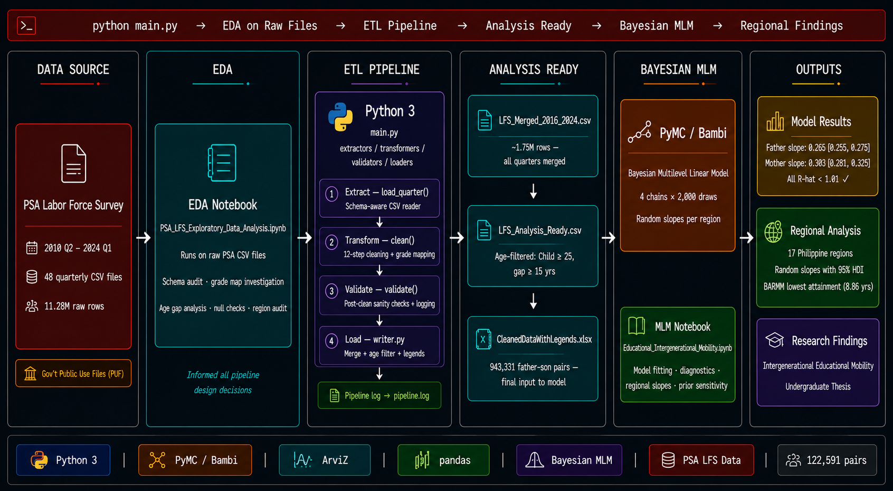
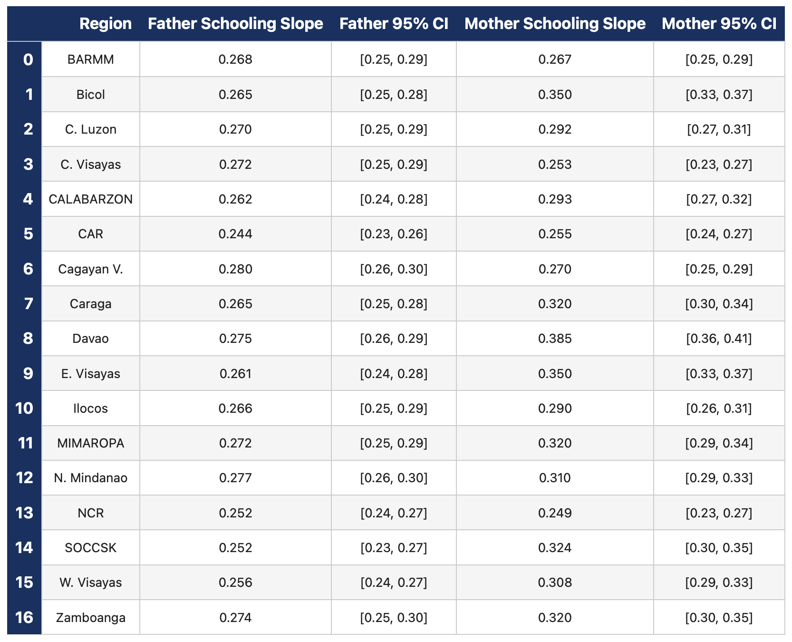

# 🇵🇭 PSA LFS Educational Intergenerational Mobility Pipeline

**Python · PyMC · Bambi · ArviZ · Bayesian Multilevel Modeling**

[](https://www.python.org/)
[](https://www.pymc.io/)
[](https://python.arviz.org/)
[](https://psa.gov.ph/)

---

## 🏗️ Architecture



---

## 📋 Table of Contents

- [Project Overview](#-project-overview)
- [Tech Stack](#-tech-stack)
- [Data Source](#-data-source)
- [Project Structure](#️-project-structure)
- [ETL Pipeline](#-etl-pipeline)
  - [Extract](#extract--extractorsloaderpy)
  - [Transform](#transform--transformers)
  - [Validate](#validate--validatorsvalidatorpy)
  - [Load](#load--loaderswriterpy)
- [Analytical Notebooks](#-analytical-notebooks)
- [Key Findings — Father–Son Educational Mobility](#-key-findings--fatherson-educational-mobility)
- [How to Run](#-how-to-run)

---

## 📌 Project Overview

An end-to-end ETL pipeline and Bayesian statistical analysis of **intergenerational educational mobility** across all 17 Philippine regions, built on nationally representative Labor Force Survey data from the Philippine Statistics Authority.

The pipeline processes **48 quarterly PSA LFS raw CSV files** (2010 Q2 – 2024 Q1, 11.28M rows) through a schema-aware ETL system — handling three different PSA column schemas, two grade coding versions introduced by the K-12 reform, and complex household pairing logic — producing a clean dataset of **122,591 father–son pairs** ready for statistical modeling.

The analytical layer fits a **Bayesian Multilevel Linear Model** using PyMC/Bambi to estimate how strongly a father's education predicts his son's educational attainment, with region-level random slopes capturing variation across the Philippines. The model includes both paternal and maternal schooling as predictors, a quadratic term for diminishing returns, and controls for household size, child age, and survey year.

**What this project builds:**
- Schema-aware ETL pipeline handling 3 PSA column formats and 2 grade coding systems
- 12-step cleaning pipeline with post-clean validation and run logging
- Parent–child household pairing logic with age gap and school attendance filters
- Bayesian Multilevel Linear Model with region-level random slopes
- EDA notebook documenting all raw data investigations that motivated pipeline decisions
- Modeling notebook with convergence diagnostics, regional slope plots, and prior sensitivity analysis

---

## 🔧 Tech Stack

| Layer | Tool | Purpose |
|---|---|---|
| ETL Pipeline | Python 3.12 | Extract, clean, validate, and merge 48 quarterly PSA files |
| Configuration | `config/settings.py` | Schema registry — maps each quarter to correct column names |
| Statistical Modeling | PyMC / Bambi | Bayesian Multilevel Linear Model with region random slopes |
| Diagnostics | ArviZ | R-hat, ESS, trace plots, posterior distributions |
| Analysis | pandas, matplotlib, seaborn | EDA, descriptives, regional visualization |

---

## 📂 Data Source

| Source | Description | Coverage | Raw Rows |
|---|---|---|---|
| [PSA Labor Force Survey](https://psa.gov.ph/statistics/survey/labor-force) | Public Use Files (PUF) — quarterly household survey | 2010 Q2 – 2024 Q1 | 11,283,759 |

**Note:** Raw PSA LFS CSV files are not included in this repository as they are publicly available from the PSA website. See [How to Run](#-how-to-run) for setup instructions.

Three quarters are excluded from analysis — 2016 Q1, 2019 Q1, and 2019 Q2 — as these were not publicly released by PSA. All other 48 quarterly files are processed automatically by the pipeline.

---

## 🗂️ Project Structure

```
psa-lfs-educational-mobility-pipeline/
│
├── config/
│   └── settings.py              # Master config — file paths, schema registry, excluded quarters
│
├── extractors/
│   └── loader.py                # Schema-aware CSV reader — handles all 3 PSA column formats
│
├── transformers/
│   ├── base_cleaner.py          # 12-step cleaning pipeline — shared across all quarters
│   ├── grade_maps.py            # Grade code mapping v1 (pre-K12) and v2 (K12) — two versions
│   └── occupation_map.py        # PSOC 2-digit to 1-digit major group mapping
│
├── validators/
│   └── validator.py             # Post-clean sanity checks — row counts, age ranges, nulls, logging
│
├── loaders/
│   └── writer.py                # Quarterly save + merge + age filter + legend assignment
│
├── notebooks/
│   ├── PSA_LFS_Exploratory_Data_Analysis.ipynb          # EDA — raw file investigation
│   └── Educational_Intergenerational_Mobility.ipynb     # Bayesian MLM — main analysis
│
├── docs/
│   ├── architecture.png                 # Pipeline architecture diagram
│   └── bayesian_model_result.png        # Regional slopes table
│
├── main.py                      # Pipeline entry point
└── README.md
```

---

## ⚙️ ETL Pipeline

The full pipeline runs with a single command and processes all 48 quarterly files end-to-end:

```
python main.py

  [Step 1]  Extract        load_quarter() — schema-aware CSV reader per quarter
       ↓
  [Step 2]  Transform      clean() — 12-step cleaning pipeline
       ↓
  [Step 3]  Validate       validate() — post-clean sanity checks + run log
       ↓
  [Step 4]  Load           save_quarter() → merge → age filter → legends
```

Individual steps can also be run separately:
```bash
python main.py --step extract    # quarterly cleaning only
python main.py --step merge      # merge + age filter only
python main.py --step legends    # final legend assignment only
```

All runs are logged automatically to `logs/pipeline_run_YYYYMMDD_HHMMSS.log`.

---

### Extract — `extractors/loader.py`

The PSA LFS changed column names across survey redesigns. The extractor handles three distinct schemas transparently:

| Schema Group | Quarters | Urban/Rural Column | HH Column |
|---|---|---|---|
| Group A | 2016 Q2 – 2019 Q4 | `PUFURB2K10` | `PUFHHNUM` |
| Group B | 2020 Q1 – 2023 Q3 | `PUFURB2015` | `PUFHHNUM` |
| Group C | 2023 Q4, 2024 Q1 | *(absent — injected as NaN)* | `PUFHHNUM` |
| Exception | 2018 Q2 only | `PUFURB2K10` | `HHSQN` |

The schema for each quarter is looked up from `config/settings.py` — no hardcoded column names anywhere in the extraction logic.

---

### Transform — `transformers/`

**`base_cleaner.py`** applies 12 cleaning steps shared across all quarters:

1. Count children per household
2. Exclude invalid grade codes (PSA sentinel codes 191, 192)
3. Exclude invalid occupation codes (Armed Forces / Not Classified: 01–03)
4. Remove currently-attending-school members
5. Keep only Head (1), Spouse (2), and Child (3) family relationships
6. Keep only eligible households — must have at least one parent AND one child
7. Split into parent and child subsets and create all parent–child pairs within each household
8. Apply grade mapping (v1 for 2016 Q2, v2 for all other quarters)
9. Apply occupation mapping (2-digit PSOC → 1-digit major group)
10. Calculate Educational Attainment and Schooling Years (0–14 scale)
11. Apply age filter: Parent ≤ 80, Child ≥ 20
12. Select, reorder, rename final columns and assign sequential household IDs

**`grade_maps.py`** — The K-12 reform mid-2016 changed what education codes mean. Code `210` means **Grade 1** in 2016 Q2 but **Grade 7** from 2016 Q3 onwards. Applying a single map would silently reclassify Grade 1 completers as Junior High graduates. Two separate maps handle this — version selected automatically per quarter from config.

---

### Validate — `validators/validator.py`

Post-clean checks run after every quarter:
- Minimum row count check (pipeline fails if below threshold)
- Negative age detection
- Age gap logging (parent–child gap < 15 years flagged)
- Schooling years range check (0–14)
- Occupation code validity check
- Duplicate household ID detection
- Null rate logging for all key columns

---

### Load — `loaders/writer.py`

After all quarterly files are cleaned:
- All 30 quarterly Excel outputs are merged into `LFS_Merged.csv`
- Age filters applied: Child ≥ 25, Parent–Child age gap ≥ 15 years, Region 18 removed, Region 19 remapped to 15
- Human-readable labels assigned (region names, occupation labels, sex labels)
- Final output: `CleanedDataWithLegends.xlsx` — **943,331 parent–child pairs**

---

## 📓 Analytical Notebooks

### EDA — `PSA_LFS_Exploratory_Data_Analysis.ipynb`

Runs directly on the raw PSA CSV files — before the pipeline. Documents every structural problem found in the raw data and the pipeline decision it motivated. Covers schema audits, grade code investigation (the K-12 cutover), occupation code mapping, regional consistency, household eligibility, age gap validation, null profiling, and schooling years distribution.

### Bayesian MLM — `Educational_Intergenerational_Mobility.ipynb`

Fits a Bayesian Multilevel Linear Model on the pipeline output using Bambi/PyMC:

```python
formula = (
    "Child_Schooling_Years ~ Father_Schooling_Years + Mother_Schooling_Years "
    "+ Father_Schooling_Years_Centered_Sq + Mother_Schooling_Years_Centered_Sq "
    "+ Children_Per_Household + C(Year) + Child_Age"
    "+ (1 + Father_Schooling_Years + Mother_Schooling_Years | Region)"
)
```

Includes: convergence diagnostics (R-hat, ESS, trace plots), regional random slope visualization, prior sensitivity analysis across three prior specifications.

---

## 📈 Key Findings — Father–Son Educational Mobility

> Full analysis in [`notebooks/Educational_Intergenerational_Mobility.ipynb`](notebooks/Educational_Intergenerational_Mobility.ipynb)

### Fixed Effects

| Parameter | Posterior Mean | 95% HDI |
|---|---|---|
| Father's Schooling (β) | **0.265** | [0.255, 0.275] |
| Mother's Schooling (β) | **0.303** | [0.281, 0.325] |
| Father's Schooling² | -0.003 | [-0.005, -0.001] |
| Residual SD (σ) | 2.777 | — |
| All R-hat | < 1.01 ✓ | — |

For every additional year of a father's education, a son is expected to complete **0.265 more years of schooling** — a substantial and persistent intergenerational link. Mother's education (0.303) exerts a stronger influence than father's, with non-overlapping HDIs confirming this is a credible difference.

### Regional Slopes



**Father–son slopes** range narrowly from 0.244 (CAR) to 0.280 (Cagayan Valley) with **all 95% HDIs overlapping** — no credible regional differences. This means father–son educational persistence is a **national structural phenomenon**, not a regional outlier problem.

**Mother–son slopes** range more widely from 0.249 (NCR) to 0.385 (Davao), with several regions having **non-overlapping HDIs** — indicating credible regional variation in maternal influence. High-persistence regions (Davao, Bicol, Eastern Visayas) tend to have limited school infrastructure, making maternal involvement a stronger determinant of sons' outcomes.

---

## 🚀 How to Run

### Prerequisites
- Python 3.8+
- PSA LFS raw CSV files — download from [PSA OpenSTAT](https://openstat.psa.gov.ph/)
- Files named in the format: `LFS PUF Q2 2016.CSV`

### Setup

```bash
# Clone the repository
git clone https://github.com/rolanddelarosaph/psa-lfs-educational-mobility-pipeline.git
cd psa-lfs-educational-mobility-pipeline

# Install dependencies
pip install -r requirements.txt

# Configure paths in config/settings.py
# Set RAW_DATA_DIR, OUTPUT_DIR, and LOG_DIR to your local folders

# Run the full ETL pipeline
python main.py
```

### Run Notebooks

```bash
jupyter notebook notebooks/
```

Open `PSA_LFS_Exploratory_Data_Analysis.ipynb` first, then `Educational_Intergenerational_Mobility.ipynb`.

---

*Data: Philippine Statistics Authority — Labor Force Survey Public Use Files*
*Research: Intergenerational Mobility in Education, Occupation, and Income: A Region-Based Study*
*Rizal Technological University · Bachelor of Science in Statistics · 2025*
